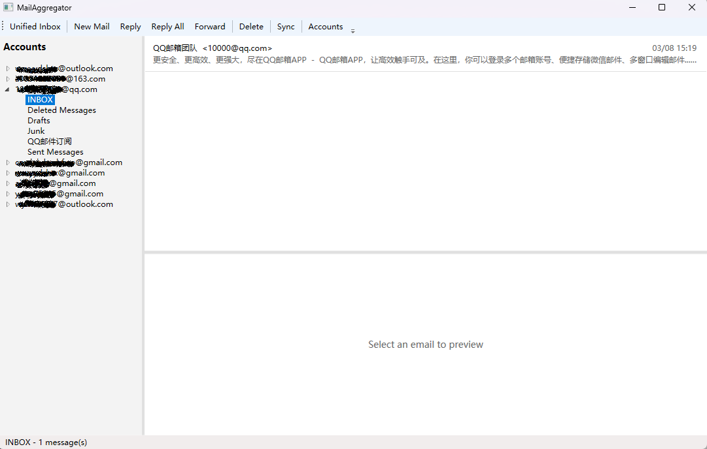

# MailAggregator

Windows desktop email client that aggregates multiple email accounts into a single interface. Connects directly via IMAP/SMTP — no backend server required.

## Demo



## Features

- **Multi-account** — manage Gmail, Microsoft, Yahoo, AOL, Fastmail, and any standard IMAP/SMTP server in one place
- **Auto-discovery** — automatically detects server settings with 5-level fallback
- **OAuth 2.0 PKCE** — secure authentication for Gmail, Microsoft, and other OAuth providers
- **IMAP IDLE** — real-time push notifications for new emails
- **Compose** — new messages, reply, and forward with attachment support
- **2FA Authenticator** — built-in TOTP code generator (like Google Authenticator), secrets encrypted locally
- **Security** — credentials encrypted with AES-256-GCM, keys protected via DPAPI
- **Offline storage** — local SQLite database for fast access

## Tech Stack

| Component | Technology |
|-----------|------------|
| Framework | .NET 8 |
| UI | WPF + WebView2 |
| Architecture | MVVM (CommunityToolkit.Mvvm) + DI |
| Mail | MailKit (IMAP/SMTP) |
| Database | EF Core + SQLite |
| Logging | Serilog |
| TOTP | OtpNet |
| Tests | xUnit (237 tests) |

## Getting Started

### Prerequisites

- Windows x64
- [.NET 8 SDK](https://dotnet.microsoft.com/download/dotnet/8.0)
- WebView2 Runtime (included in Windows 11, [download for Windows 10](https://developer.microsoft.com/en-us/microsoft-edge/webview2/))

### Build & Run

```bash
dotnet restore MailAggregator.sln
dotnet build MailAggregator.sln
dotnet run --project src/MailAggregator.Desktop
```

### Run Tests

```bash
dotnet test MailAggregator.sln
```

## Project Structure

```
MailAggregator.sln
├── src/
│   ├── MailAggregator.Core/        # Cross-platform core: models, services, data access
│   └── MailAggregator.Desktop/     # WPF UI: views, view models, styles
└── src/MailAggregator.Tests/       # xUnit tests
```

## Release

CI/CD is tag-triggered via GitHub Actions. To create a release:

```bash
git tag v1.0.x
git push origin v1.0.x
```

This builds a self-contained `win-x64` executable and uploads it to GitHub Releases.
